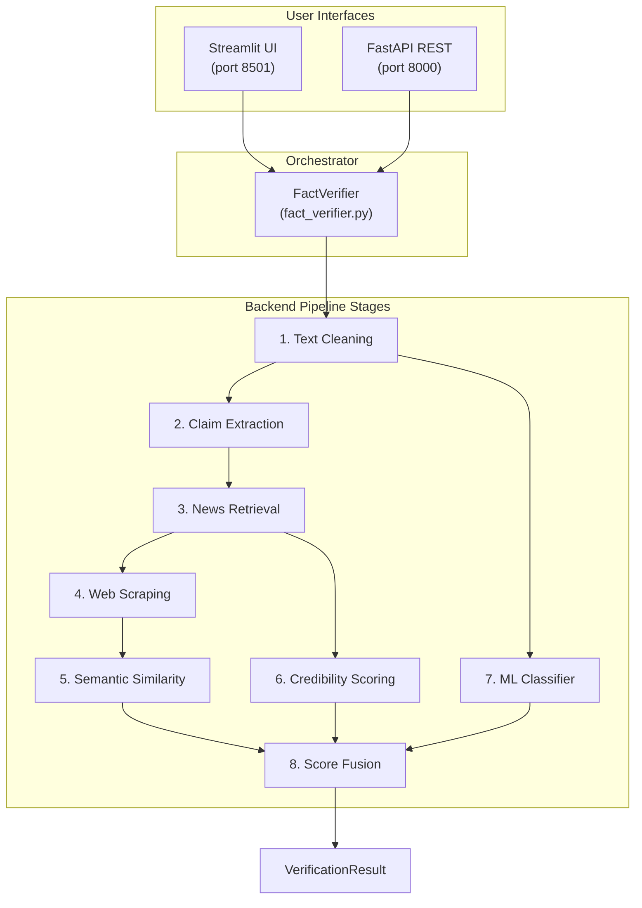
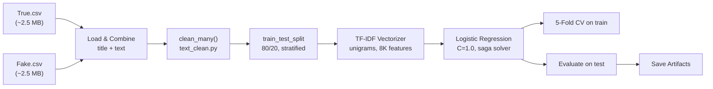
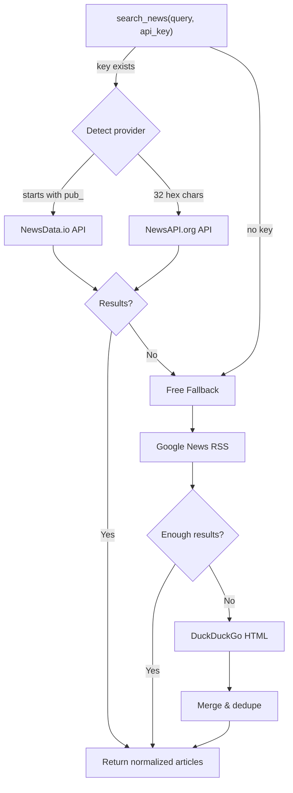
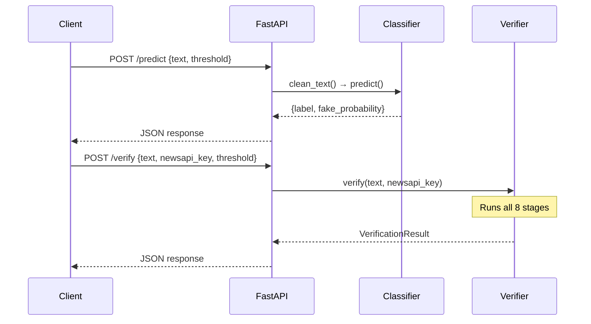
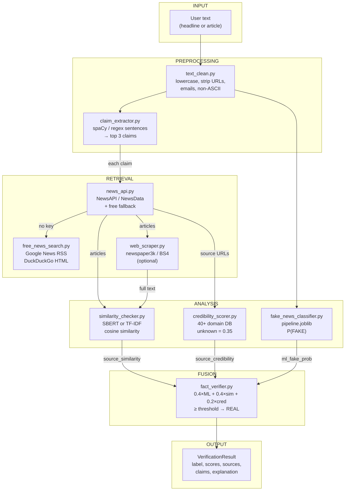

# 🔍 Fake News Verifier v2.0 — Complete Application Walkthrough

> **Scope:** Every file, every backend process, every data transformation — end to end.

---

## Table of Contents
- [High-Level Architecture](#high-level-architecture)
- [Project File Map](#project-file-map)
- [Phase 1 — Model Training Pipeline](#phase-1--model-training-pipeline)
- [Phase 2 — Runtime Verification Pipeline](#phase-2--runtime-verification-pipeline)
  - [Step 1: Text Cleaning](#step-1-text-cleaning)
  - [Step 2: Claim Extraction](#step-2-claim-extraction)
  - [Step 3: News Retrieval](#step-3-news-retrieval)
  - [Step 4: Web Scraping (Optional)](#step-4-web-scraping-optional)
  - [Step 5: Semantic Similarity](#step-5-semantic-similarity)
  - [Step 6: Source Credibility Scoring](#step-6-source-credibility-scoring)
  - [Step 7: ML Classification](#step-7-ml-classification)
  - [Step 8: Score Fusion & Final Verdict](#step-8-score-fusion--final-verdict)
- [Backend Interfaces](#backend-interfaces)
  - [FastAPI Server](#fastapi-server)
  - [Streamlit Frontend](#streamlit-frontend)
- [Data Flow Diagram](#data-flow-diagram)
- [Model Performance](#model-performance)

---

## High-Level Architecture



---

## Project File Map

| File | Role | Lines |
|------|------|-------|
| [train_model.py](file:///c:/Users/VANDIT%20SHARMA/OneDrive/Desktop/CollegeProject/vandit/fake-news-verifier/train_model.py) | **Offline** — trains TF-IDF + LogReg, saves `.joblib` artifacts | 184 |
| [text_clean.py](file:///c:/Users/VANDIT%20SHARMA/OneDrive/Desktop/CollegeProject/vandit/fake-news-verifier/src/preprocessing/text_clean.py) | Regex-based text normalization | 39 |
| [claim_extractor.py](file:///c:/Users/VANDIT%20SHARMA/OneDrive/Desktop/CollegeProject/vandit/fake-news-verifier/src/preprocessing/claim_extractor.py) | Splits article → top-N factual sentences | 71 |
| [news_api.py](file:///c:/Users/VANDIT%20SHARMA/OneDrive/Desktop/CollegeProject/vandit/fake-news-verifier/src/retrieval/news_api.py) | Unified search (NewsAPI / NewsData / free fallback) | 169 |
| [free_news_search.py](file:///c:/Users/VANDIT%20SHARMA/OneDrive/Desktop/CollegeProject/vandit/fake-news-verifier/src/retrieval/free_news_search.py) | Google News RSS + DuckDuckGo (zero API key) | 251 |
| [web_scraper.py](file:///c:/Users/VANDIT%20SHARMA/OneDrive/Desktop/CollegeProject/vandit/fake-news-verifier/src/retrieval/web_scraper.py) | newspaper3k + BS4 full-text extraction | 84 |
| [similarity_checker.py](file:///c:/Users/VANDIT%20SHARMA/OneDrive/Desktop/CollegeProject/vandit/fake-news-verifier/src/verification/similarity_checker.py) | Sentence-BERT / TF-IDF cosine similarity | 75 |
| [credibility_scorer.py](file:///c:/Users/VANDIT%20SHARMA/OneDrive/Desktop/CollegeProject/vandit/fake-news-verifier/src/verification/credibility_scorer.py) | 40+ domain credibility database + scoring | 129 |
| [fact_verifier.py](file:///c:/Users/VANDIT%20SHARMA/OneDrive/Desktop/CollegeProject/vandit/fake-news-verifier/src/verification/fact_verifier.py) | **Central orchestrator** — glues all stages | 277 |
| [fake_news_classifier.py](file:///c:/Users/VANDIT%20SHARMA/OneDrive/Desktop/CollegeProject/vandit/fake-news-verifier/src/models/fake_news_classifier.py) | Thin wrapper around trained sklearn pipeline | 83 |
| [server.py](file:///c:/Users/VANDIT%20SHARMA/OneDrive/Desktop/CollegeProject/vandit/fake-news-verifier/src/api/server.py) | FastAPI REST backend (`/predict`, `/verify`, `/health`) | 128 |
| [streamlit_app.py](file:///c:/Users/VANDIT%20SHARMA/OneDrive/Desktop/CollegeProject/vandit/fake-news-verifier/frontend/streamlit_app.py) | Web dashboard UI | 479 |
| [helpers.py](file:///c:/Users/VANDIT%20SHARMA/OneDrive/Desktop/CollegeProject/vandit/fake-news-verifier/src/utils/helpers.py) | `ensure_dir`, `save_json`, `load_json` | 29 |

---

## Phase 1 — Model Training Pipeline

> **File:** [train_model.py](file:///c:/Users/VANDIT%20SHARMA/OneDrive/Desktop/CollegeProject/vandit/fake-news-verifier/train_model.py)  
> **Run:** `python train_model.py --real data/raw/True.csv --fake data/raw/Fake.csv --outdir models`

This is an **offline, one-time** process. The trained model artifacts are then loaded at runtime.

### Process flow:



### Step-by-step:

1. **Load CSVs** — reads `True.csv` (label `0` = REAL) and `Fake.csv` (label `1` = FAKE). Handles encoding with `utf-8` → `latin-1` fallback.

2. **Combine columns** — concatenates `title` + `text` into a single `combined` field per article.

3. **Text cleaning** — calls `clean_many()` (from [text_clean.py](file:///c:/Users/VANDIT%20SHARMA/OneDrive/Desktop/CollegeProject/vandit/fake-news-verifier/src/preprocessing/text_clean.py)):
   - Lowercase
   - Strip URLs, emails, non-ASCII characters
   - Collapse whitespace

4. **Train/test split** — 80% train / 20% test, stratified by label, `random_state=42`.

5. **Build sklearn Pipeline:**
   ```
   Pipeline([
       ("tfidf", TfidfVectorizer(
           sublinear_tf=True,          # log(1 + tf)
           stop_words="english",       # remove common words
           ngram_range=(1, 1),         # unigrams only (memory-safe)
           max_features=8000,          # cap vocabulary
           dtype=np.float32            # half memory vs float64
       )),
       ("clf", LogisticRegression(
           C=1.0,                      # regularization strength
           max_iter=1000,
           class_weight="balanced",    # handle class imbalance
           solver="saga",              # efficient for sparse matrices
           n_jobs=1                    # avoid memory duplication
       ))
   ])
   ```

6. **Cross-validate** — 5-fold stratified CV on training split only, scoring by `f1_macro`.

7. **Fit & evaluate** — fit on full training data, predict probabilities on test set, compute accuracy, ROC-AUC, average precision, classification report.

8. **Save artifacts:**
   - `models/pipeline.joblib` — full sklearn pipeline (297 KB)
   - `models/vectorizer.joblib` — just the TF-IDF vectorizer (264 KB)
   - `models/fake_news_model.joblib` — just the LogReg classifier (32 KB)
   - `models/metrics.json` — evaluation metrics
   - `models/charts/` — confusion matrix, ROC curve, PR curve PNGs

---

## Phase 2 — Runtime Verification Pipeline

> **Central Orchestrator:** [fact_verifier.py → FactVerifier.verify()](file:///c:/Users/VANDIT%20SHARMA/OneDrive/Desktop/CollegeProject/vandit/fake-news-verifier/src/verification/fact_verifier.py#L178-L276)

When a user submits an article, the `FactVerifier.verify()` method executes **8 sequential stages**:

---

### Step 1: Text Cleaning

> **File:** [text_clean.py](file:///c:/Users/VANDIT%20SHARMA/OneDrive/Desktop/CollegeProject/vandit/fake-news-verifier/src/preprocessing/text_clean.py)

```
Input:  "NASA says asteroid https://t.co/xyz will hit Earth!!! 🌍"
Output: "nasa says asteroid will hit earth!!!"
```

**What happens internally:**
1. **Lowercase** the entire string
2. **Remove URLs** — regex `https?://\S+` → replaced with space
3. **Remove emails** — regex `\S+@\S+` → replaced with space
4. **Remove non-ASCII** — strips emojis, accented chars, etc.
5. **Collapse whitespace** — multiple spaces → single space, then `strip()`

> [!NOTE]
> This is a "bag of words" preprocessing — it does NOT do stemming, lemmatization, or POS tagging. That's intentional: TF-IDF + LogReg works best with minimal transformation on news text.

---

### Step 2: Claim Extraction

> **File:** [claim_extractor.py](file:///c:/Users/VANDIT%20SHARMA/OneDrive/Desktop/CollegeProject/vandit/fake-news-verifier/src/preprocessing/claim_extractor.py)

**Purpose:** Break the article into individual factual sentences that can be searched independently.

**Process:**
1. **Sentence splitting** — uses **spaCy** `en_core_web_sm` model if installed, otherwise falls back to regex `(?<=[.!?])\s+`
2. **Filter** — discard sentences shorter than 30 characters
3. **Rank** — sort remaining by length (longest first — assumption: more words = more content)
4. **Return top `max_claims`** (default: 3 for verify, 5 standalone)

```
Input:  "NASA confirmed an asteroid. It is very large.
         The object is 500 meters wide and will pass within
         1 million km of Earth on Tuesday."
         
Output: ["The object is 500 meters wide and will pass within 1 million km of Earth on Tuesday.",
         "NASA confirmed an asteroid."]
```

> [!IMPORTANT]
> If no claims pass the filter (e.g., very short headline), the orchestrator falls back to using the first 200 characters of cleaned text as a single "claim".

---

### Step 3: News Retrieval

> **Files:** [news_api.py](file:///c:/Users/VANDIT%20SHARMA/OneDrive/Desktop/CollegeProject/vandit/fake-news-verifier/src/retrieval/news_api.py) + [free_news_search.py](file:///c:/Users/VANDIT%20SHARMA/OneDrive/Desktop/CollegeProject/vandit/fake-news-verifier/src/retrieval/free_news_search.py)

This is the **multi-provider news search system** with automatic fallback:



**Provider detection** (in `news_api.py`):
- Key starts with `pub_` → **NewsData.io** (`/api/1/latest`)
- Otherwise → **NewsAPI.org** (`/v2/everything`)
- No key at all → skip to free sources

**Free sources** (in `free_news_search.py` — zero API key required):
1. **Google News RSS** — parses XML from `news.google.com/rss/search?q=...`, strips HTML from descriptions, cleans source names
2. **DuckDuckGo HTML** — POST to `html.duckduckgo.com/html/` with `"{query} news"`, parses with BS4 (or regex fallback), unwraps redirect URLs

**Normalized output format** (every provider returns the same schema):
```json
{
  "title": "...",
  "description": "...",
  "url": "https://...",
  "source": "Reuters",
  "publishedAt": "2026-04-17T...",
  "content": "..."
}
```

**For each claim**, up to `max_sources` (default 5) articles are fetched. Results are **deduplicated by URL** across all claims.

---

### Step 4: Web Scraping (Optional)

> **File:** [web_scraper.py](file:///c:/Users/VANDIT%20SHARMA/OneDrive/Desktop/CollegeProject/vandit/fake-news-verifier/src/retrieval/web_scraper.py)

**Only runs when `scrape=True`** (disabled by default for speed).

**Dual-strategy extraction:**
1. **newspaper3k** (preferred) — `Article(url).download().parse()` → returns clean article text
2. **BeautifulSoup4** (fallback) — GET the page, strip `<script>`, `<style>`, `<nav>`, `<footer>`, `<header>` tags, collapse whitespace

**If both fail**, falls back to using title + description from the news search results.

**Without scraping:** the system uses `title + " " + description` from the search results as the reference text for similarity comparison.

---

### Step 5: Semantic Similarity

> **File:** [similarity_checker.py](file:///c:/Users/VANDIT%20SHARMA/OneDrive/Desktop/CollegeProject/vandit/fake-news-verifier/src/verification/similarity_checker.py)

**Purpose:** How much does the input article's content match what real news sources are saying?

**Two engines** (automatic selection):

| Engine | Condition | Method |
|--------|-----------|--------|
| **Sentence-BERT** | `sentence-transformers` installed | Encode both texts with `all-MiniLM-L6-v2`, compute cosine similarity |
| **TF-IDF** (fallback) | No sentence-transformers | Fit a `TfidfVectorizer(max_features=5000)` on the two texts, compute cosine similarity |

**How it's used in the pipeline:**
- For each retrieved article's text, compute `similarity_score(cleaned_input, reference_text)`
- **Average** all individual scores → `source_similarity` (0.0 to 1.0)

> [!TIP]
> Higher similarity = the article's claims are being reported by other sources too. Low similarity = the claims are unique/unverified, which is suspicious.

---

### Step 6: Source Credibility Scoring

> **File:** [credibility_scorer.py](file:///c:/Users/VANDIT%20SHARMA/OneDrive/Desktop/CollegeProject/vandit/fake-news-verifier/src/verification/credibility_scorer.py)

**Purpose:** Rate how trustworthy the news sources that cover this story are.

**Database of 40+ domains** with hand-curated scores:

| Tier | Score Range | Examples |
|------|------------|----------|
| Wire services | 0.95–0.97 | Reuters, AP, AFP |
| Public broadcasters | 0.90–0.95 | BBC, NPR, PBS |
| Fact-check orgs | 0.90–0.97 | Snopes, PolitiFact, Nature, WHO |
| Major outlets | 0.80–0.90 | NYT, WSJ, Guardian, The Hindu |
| General outlets | 0.65–0.79 | Fox News, MSNBC, Times of India |
| **Unknown domain** | **0.35** | Any unrated domain |

**Matching logic:**
1. Extract domain from URL (strip `www.`, extract `netloc`)
2. Exact match against database
3. Partial match — `domain.endswith(known)` or `known.endswith(domain)` (handles subdomains like `news.bbc.co.uk`)
4. No match → default `0.35`

**Aggregation:** Average credibility of all sources' URLs → `source_credibility`

---

### Step 7: ML Classification

> **File:** [fake_news_classifier.py](file:///c:/Users/VANDIT%20SHARMA/OneDrive/Desktop/CollegeProject/vandit/fake-news-verifier/src/models/fake_news_classifier.py) (wrapper)  
> **Used inside:** [fact_verifier.py](file:///c:/Users/VANDIT%20SHARMA/OneDrive/Desktop/CollegeProject/vandit/fake-news-verifier/src/verification/fact_verifier.py#L165-L172)

**Process:**
1. Load the pre-trained `pipeline.joblib` (or separate `vectorizer.joblib` + `fake_news_model.joblib`)
2. Run `pipe.predict_proba([cleaned_text])` → returns `[P(REAL), P(FAKE)]`
3. Extract `P(FAKE)` as `ml_fake_probability`

**If no model is loaded**, returns `0.5` (neutral — doesn't influence the final score either way).

---

### Step 8: Score Fusion & Final Verdict

> **File:** [fact_verifier.py, lines 244-253](file:///c:/Users/VANDIT%20SHARMA/OneDrive/Desktop/CollegeProject/vandit/fake-news-verifier/src/verification/fact_verifier.py#L244-L253)

**The core formula:**

```
credibility_score = w_ml × (1 - ml_fake_prob)
                  + w_sim × source_similarity
                  + w_cred × source_credibility

Default weights: w_ml=0.40, w_sim=0.40, w_cred=0.20
```

**Breaking this down:**

| Component | Weight | What it measures | Range |
|-----------|--------|-----------------|-------|
| `(1 - ml_fake_prob)` | 40% | ML model's confidence article is **real** | 0–1 |
| `source_similarity` | 40% | How much external sources corroborate the claims | 0–1 |
| `source_credibility` | 20% | How trustworthy the corroborating sources are | 0–1 |

**Decision rule:**
```
if credibility_score >= threshold (default 0.45):
    label = "REAL"
else:
    label = "FAKE"
```

**Human-readable explanation** is generated as a pipe-separated summary string, e.g.:
```
ML model says FAKE (fake prob=72%) | Found 5 source(s) via NewsAPI. |
Average source similarity: 6% | Average source credibility: 35% |
Combined credibility score: 18% → FAKE
```

**Output:** A `VerificationResult` dataclass containing all scores, sources, claims, and the final verdict.

---

## Backend Interfaces

### FastAPI Server

> **File:** [server.py](file:///c:/Users/VANDIT%20SHARMA/OneDrive/Desktop/CollegeProject/vandit/fake-news-verifier/src/api/server.py)  
> **Run:** `uvicorn src.api.server:app --reload --port 8000`

**Startup process:**
1. Adds project root to `sys.path`
2. Creates a `FakeNewsClassifier` instance (loads `.joblib` files)
3. Creates a `FactVerifier` instance (loads same model + all sub-modules)
4. Enables CORS for all origins

**Three endpoints:**

| Endpoint | Method | Purpose | External calls? |
|----------|--------|---------|----------------|
| `/health` | GET | Health check, reports if ML model is loaded | No |
| `/predict` | POST | ML-only quick prediction | No |
| `/verify` | POST | Full 8-stage pipeline | Yes (News APIs, optional scraping) |



---

### Streamlit Frontend

> **File:** [streamlit_app.py](file:///c:/Users/VANDIT%20SHARMA/OneDrive/Desktop/CollegeProject/vandit/fake-news-verifier/frontend/streamlit_app.py)  
> **Run:** `streamlit run frontend/streamlit_app.py`

**Layout:**

```
┌─────────────────────────────────────────────────┐
│  🔍 Fake News & Misinformation Verifier         │
│  ML classifier + multi-source verification      │
├────────────────────────────┬────────────────────┤
│ [Text Area - 180px]       │ 💡 Tips            │
│                            │  - paste full text │
│                            │  - add API key     │
├──────────┬─────────────────┴────────────────────┤
│ ⚡ Quick  │ 🌐 Verify with Sources              │
│ Predict  │ (disabled if no API key)              │
├──────────┴──────────────────────────────────────┤
│ Results area (verdict, scores, sources, etc.)    │
└─────────────────────────────────────────────────┘
```

**Sidebar controls:**
- Model status indicator (✅/❌)
- API key input (password field, auto-detects provider format)
- Credibility threshold slider (0.10–0.90, default 0.45)
- Scrape toggle
- Max sources slider (2–10, default 5)
- Score weights (ML, similarity, credibility) — auto-normalized to sum=1.0

**Two modes:**

1. **⚡ Quick Predict** — calls `FakeNewsClassifier.predict()` directly. No external API calls. Shows label + probability bars.

2. **🌐 Verify with Sources** — calls `FactVerifier.verify()` with full pipeline. Displays:
   - Verdict banner (green REAL / red FAKE)
   - Credibility score progress bar
   - 4-column metrics (overall, ML, similarity, credibility)
   - Score breakdown with mini-bars
   - Extracted claims list
   - Source cards with credibility indicators (🟢/🟡/🔴) and links
   - Human-readable explanation

---

## Data Flow Diagram



---

## Model Performance

The trained model achieves outstanding results on the test set:

| Metric | Value |
|--------|-------|
| **Accuracy** | 99.75% |
| **ROC-AUC** | 1.0000 |
| **Average Precision** | 1.0000 |
| **Cross-Val F1 (5-fold)** | 0.992 ± 0.006 |

| Class | Precision | Recall | F1-Score | Support |
|-------|-----------|--------|----------|---------|
| REAL | 0.995 | 1.000 | 0.998 | 200 |
| FAKE | 1.000 | 0.995 | 0.997 | 200 |

> [!WARNING]
> These near-perfect scores are likely due to the dataset containing stylistic patterns (e.g., Reuters disclaimers in REAL articles). The ML component captures **writing style**, not factual accuracy — which is why the multi-source verification pipeline exists as a complementary signal.

---

## Summary of All Backend Processes

| # | Process | File | What it does | When it runs |
|---|---------|------|-------------|--------------|
| 1 | **Model Training** | `train_model.py` | TF-IDF → LogReg on True/Fake CSVs | Offline, once |
| 2 | **Text Normalization** | `text_clean.py` | Lowercase, strip URLs/emails/non-ASCII | Every request |
| 3 | **Claim Extraction** | `claim_extractor.py` | spaCy sentence split → top-N by length | Every verify request |
| 4 | **News Search (paid)** | `news_api.py` | NewsAPI.org or NewsData.io API calls | If API key present |
| 5 | **News Search (free)** | `free_news_search.py` | Google News RSS + DuckDuckGo scrape | If no key / as fallback |
| 6 | **Article Scraping** | `web_scraper.py` | newspaper3k / BS4 full-text extraction | Only if `scrape=True` |
| 7 | **Semantic Similarity** | `similarity_checker.py` | SBERT or TF-IDF cosine between texts | Every verify request |
| 8 | **Credibility Scoring** | `credibility_scorer.py` | Domain lookup in 40+ trusted DB | Every verify request |
| 9 | **ML Classification** | `fake_news_classifier.py` | `predict_proba()` on cleaned text | Every request |
| 10 | **Score Fusion** | `fact_verifier.py` | Weighted sum → threshold → verdict | Every verify request |
| 11 | **FastAPI Server** | `server.py` | REST endpoints `/predict`, `/verify` | Server runtime |
| 12 | **Streamlit UI** | `streamlit_app.py` | Interactive web dashboard | UI runtime |
| 13 | **Utilities** | `helpers.py` | `ensure_dir`, `save_json`, `load_json` | As needed |
